# Table of Content

- [Table of Content](#table-of-content)
- [Versions](#versions)
- [Install Maven](#install-maven)
- [Install Docker](#install-docker)
- [Create Docker Repository](#create-docker-repository)
- [Install Homebrew](#install-homebrew)
- [Install Jenkins](#install-jenkins)
- [Jenkins Plugins](#jenkins-plugins)
- [(*optional*) Jenkins Global Tool Configuration](#optional-jenkins-global-tool-configuration)
- [Create JAR using Jenkins Job](#create-jar-using-jenkins-job)
- [Create Docker image from the JAR](#create-docker-image-from-the-jar)
- [Errors](#errors)

# Versions

- OS: MacOS Ventura (13.1)
- VS Code: 1.74.2
- Apache Maven: 3.8.7
- Docker: 20.10.21
- Java: 19.0.1

# Install Maven

1. Go to [here](https://maven.apache.org/download.cgi) and download the **Binary tar.gz archive** of the latest version
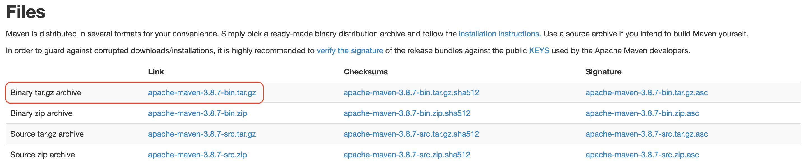

2. Extract it using the following command

```
tar -xvf apache-maven-3.8.7-bin.tar.gz
```

3. Take the path to your Apache Maven folder

4. Open a Terminal and enter the following command

```
nano ~/.bash_profile
```
5. Here paste the following lines of code. Change the path with your personal Apache Maven path.
   
```
export M2_HOME=/Users/ovidiuceoca/Documents/Maven/apache-maven-3.8.7
export PATH=$PATH:$M2_HOME/bin
```

6. Press **Control+X > Y > Return/Enter**

7. In the same terminal run the following command

```
source ~/.bash_profile
```

8. If there are cases when you get the error **mvn: command not found** just run in a terminal the command above to update the *bash_profile*
   
9. To see if everything is ok run the following command

```
mvn -version
```

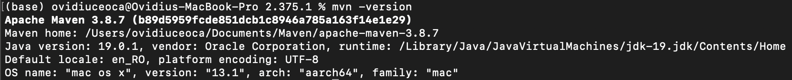

# Install Docker

You cand install *Docker* from [here](https://www.docker.com)

# Create Docker Repository

1. Go to this [link](https://hub.docker.com)
2. You should see something like this
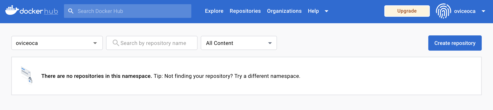
3. Click **Create repository** and give it a name
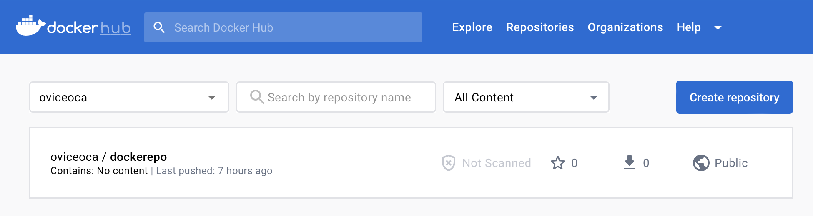

# Install Homebrew

You can install *Homebrew* from [here](https://brew.sh)

# Install Jenkins

1. Install Jenkins
   
```
brew install jenkins-lts
```
2. Run Jenkins

```
brew services start jenkins-lts
```

3. Follow the instructions from [here](https://github.com/ceoca-ovidiu/jenkins/blob/main/README.md) to configure Jenkins

4. If you get some kind of error with Jenkins not starting up just use

```
brew services restart jenkins-lts
```

! On "Unlock Jenkins" page is the path where you can find the initial password that you need to use.

# Jenkins Plugins

1. Go to Jenkins *Dashboard*
2. On the left side, click on **Manage Jenkins**
3. Click on **Manage Plugins**
4. Here click on **Available Plugins**
5. Install the following *Docker* plugins and **Restart** Jenkins
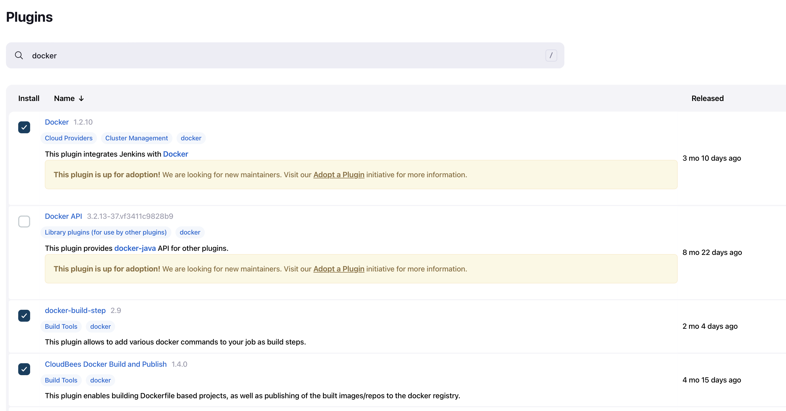

# (*optional*) Jenkins Global Tool Configuration

Here you can install Docker and Maven directly into Jenkins.

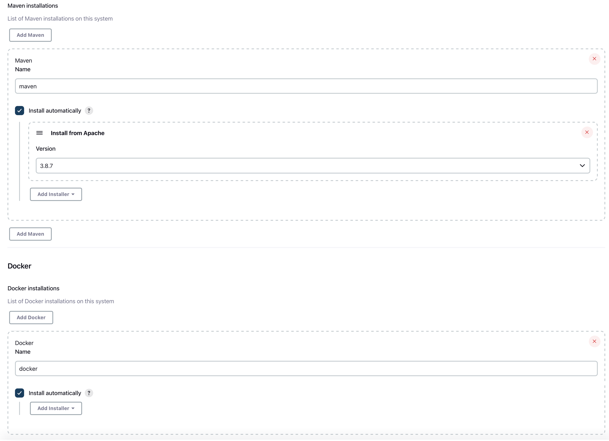

# Create JAR using Jenkins Job

1. On the top left cornet press **New Item**
2. Enter a name and choose **Freestyle Project**
3. Enter the link to your project in **GitHub project**
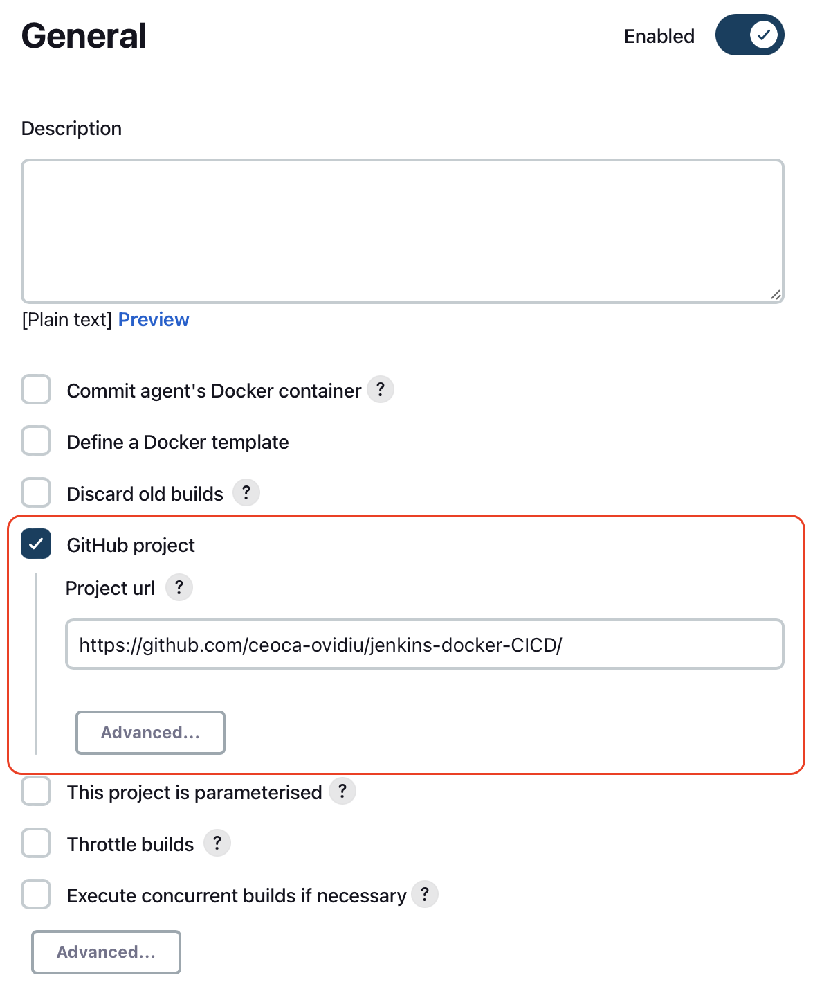

4. In **Source Code Management** add the *Git repository* and change the branch from *master* to *main*
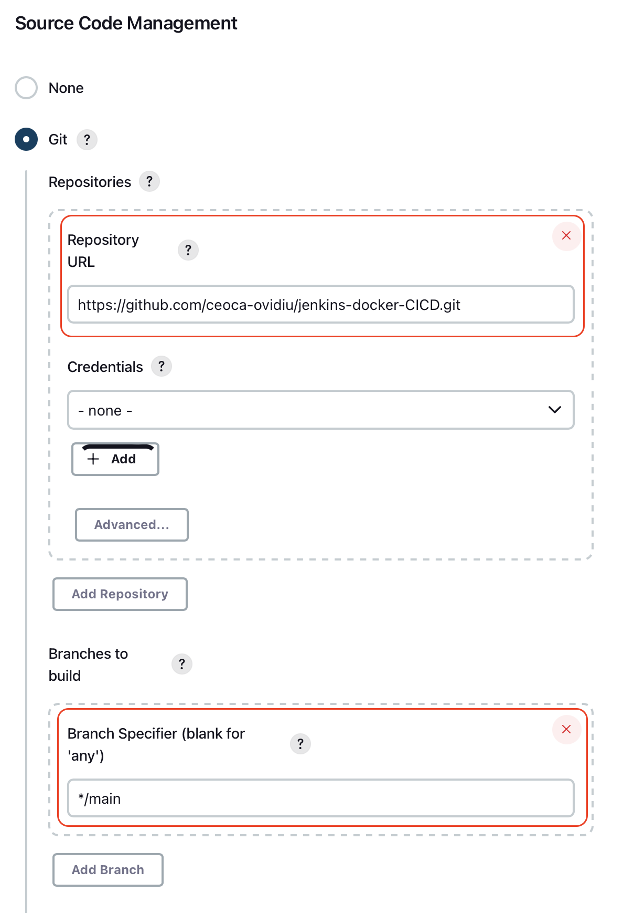

5. In the **Build Triggers** section, check *Poll SCM* to check for repo update and add the [CRON](https://en.wikipedia.org/wiki/Cron#CRON_expression) syntax.
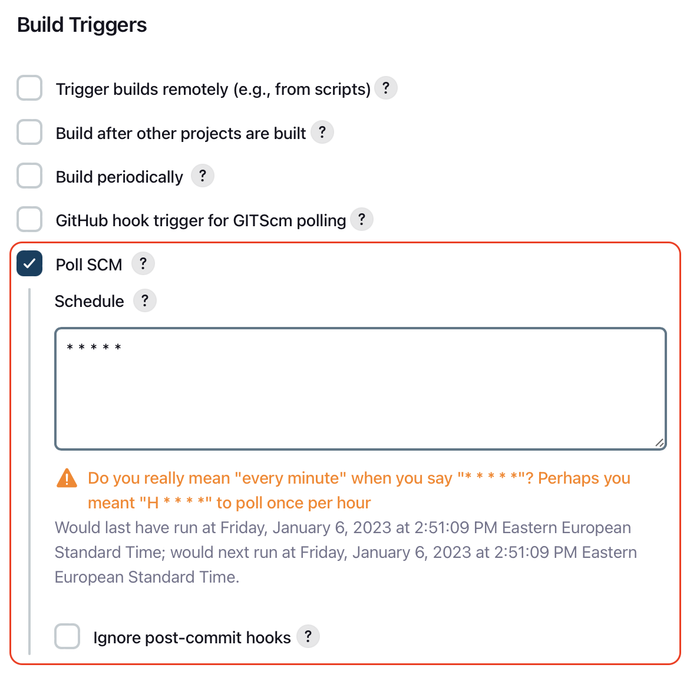

6. In **Build Steps** section, select *Execute shell* and insert the following lines of code
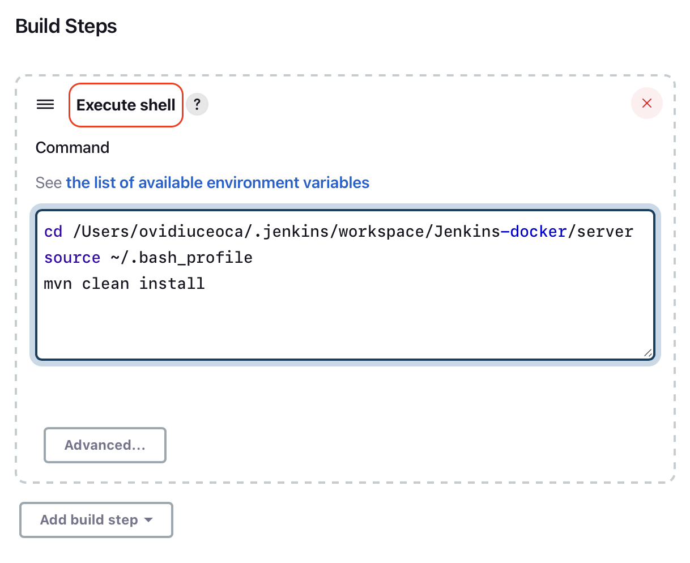
```
cd /Users/ovidiuceoca/.jenkins/workspace/Jenkins-docker/server
source ~/.bash_profile
mvn clean install
```

1. Select the job from the **Dashboard > Workspace (left side) > server > target**. Here you can see the jars created.
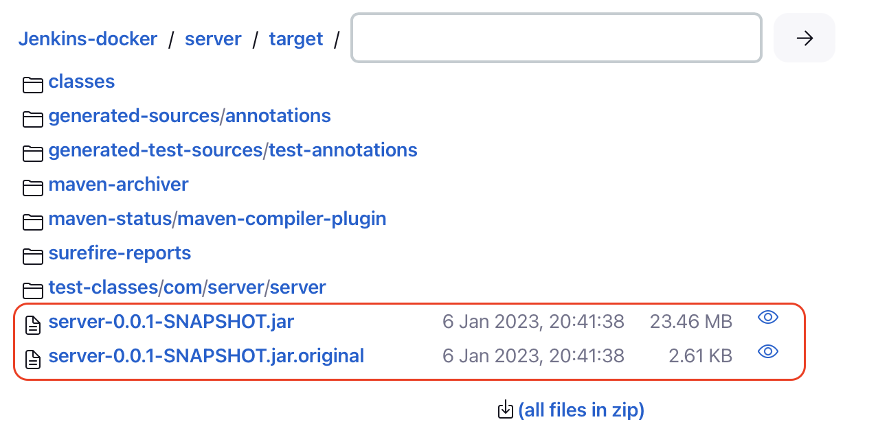

> NOTE: Change the lines according to your setup. 

# Create Docker image from the JAR

1. Select the job and click on **Configure**
2. Just add the following lines of code in **Build Steps** 
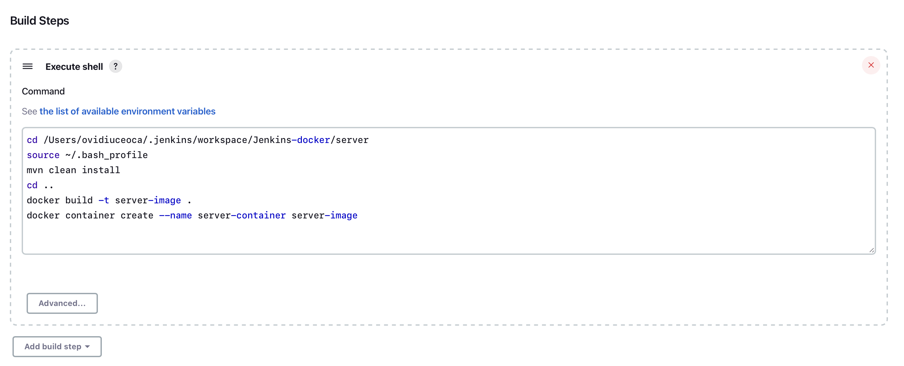
```
cd ..
docker build -t server-image .
docker run server-image server-container
```
3. There should be some error regarding *Docker* like **docker: command not found**, but you can follow the optional step above to install it in *Jenkins* and after that restart both platforms.
4. After running the job again, the docker starts creating the image   
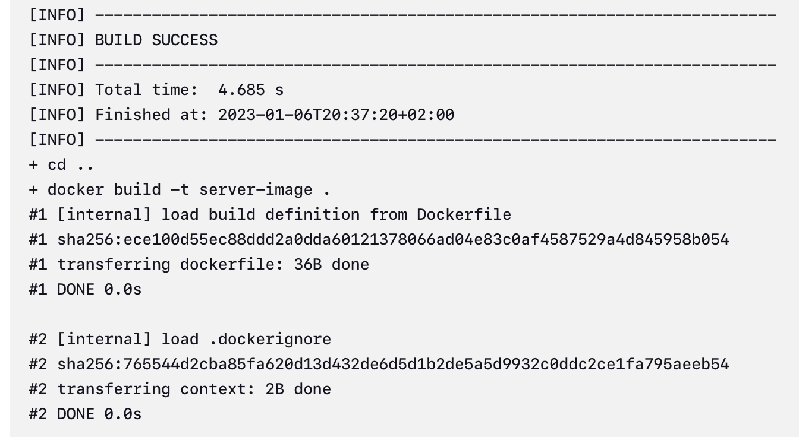
# Errors
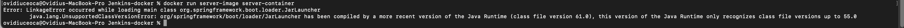